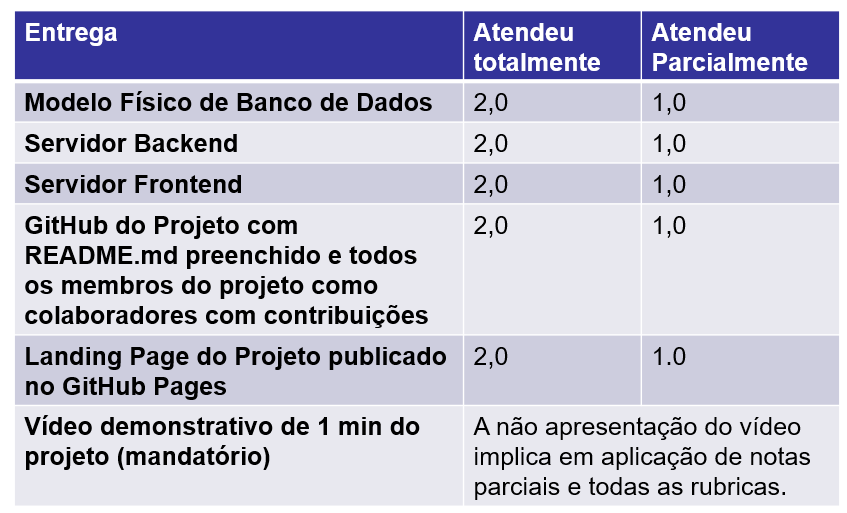
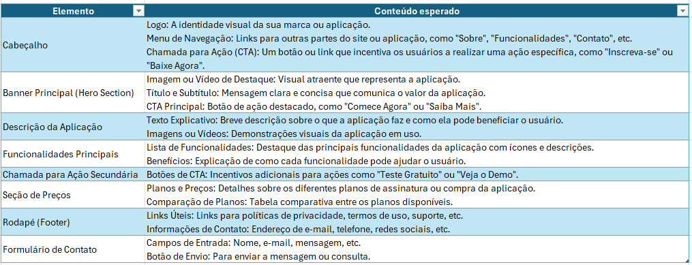

# PROJETO INTEGRADOR 5
# SENAC 2025 - TADS - GRUPO 9

DISCIPLINA: STADCAS5DA_2501-2501-686302 2501-PROJETO INTEGRADOR: ANÁLISE DE SOLUÇÕES INTEGRADAS PARA ORGANIZAÇÕES  
PROFESSOR: CARLOS HENRIQUE VERISSIMO PEREIRA 
ALUNOS DESENVOLVEDORES:  
<ul><li><b>Alexsandra Oliveira de Jesus</b></li><li><b>Ana Karolini Bloemer Noth</b></li><li><b>Henrique Carvalho Silva </b></li><li><b>Julia Petrucci dos Santos </b></li><li><b>Thalita Pereira Alfonso</b></li></ul>

<h1>Enunciado</h1>

Neste Projeto Integrador, foi elaborado uma solução de software, levando em consideração uma visão holística, com foco em serviço de TI, desde a concepção da visão do produto, valores a serem agregados, interesses das partes interessadas e elaboração de MVP (Minimum Viable Product) conforme orientações do professor da Web Conferências do professor.

<h3>Esse projeto possui duas entregas:</h3>

<h2>Primeira Parte</h2>
Ja realizada e avaliada pela própria equipe de docentes da instituição, e uma cópia foi adicionada nesse projeto caso interessados tem intenção de revisá-lo. 

<h2>Segunda Parte</h2>
Entrega final do projeto por meio dessa publicação do GITHUB, seguindo os critérios abaixo:

Somando os itens da Landing Page:

